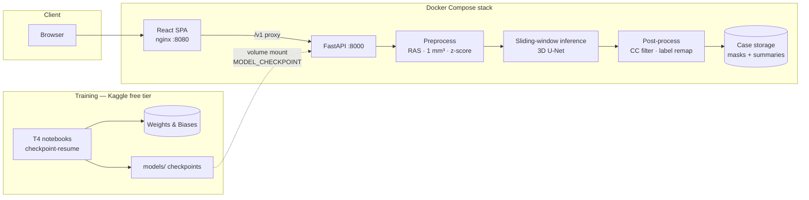

# Medical Imaging Diagnostic Pipeline — BraTS Brain Tumor Segmentation

End-to-end brain tumor segmentation from multi-modal MRI (T1, T1ce, T2,
FLAIR): a 3D U-Net trained from scratch on BraTS2020, benchmarked against
nnU-Net on an identical patient split, and served through a FastAPI + React
stack that runs with one `docker compose up`.

> **Not a medical device.** This is a research and educational pipeline. It
> has no regulatory clearance (FDA/CE) and must not be used for clinical
> diagnosis, treatment planning, or any decision affecting patient care.
> The same disclaimer is embedded in every inference response and UI view
> (SRS Section 14).

## Results

3-fold patient-level cross-validation, BraTS2020 (368 valid cases), 3D
U-Net baseline trained entirely on Kaggle free-tier T4 GPUs (16 GB, 30
GPU-hrs/week, 12-hr sessions, checkpoint-resume across sessions):

| Region | Dice (mean ± std, 3 folds) | Promotion gate |
| --- | --- | --- |
| Whole Tumor (WT) | **0.899 ± 0.005** | ≥ 0.85 |
| Tumor Core (TC) | **0.851 ± 0.017** | ≥ 0.80 |
| Enhancing Tumor (ET) | **0.790 ± 0.012** | ≥ 0.75 |
| Overall mean | **0.847 ± 0.009** | — |

Every fold passes the quality gate individually (SRS Sections 5, 9.4).
Cross-validation is 3-fold rather than 5-fold — a documented scope
reduction sized to the weekly GPU quota (SRS Section 2.6, decision 13).

### nnU-Net benchmark (same split)

nnU-Net v2 (100 epochs, epoch cap measured against the T4 budget) was run
with its 5-fold split overridden to validate on **exactly the same held-out
patients** as baseline fold 0, so the comparison is apples-to-apples
(SRS decision 17):

| Model (fold-0 validation, n=74) | ET | TC | WT | Mean |
| --- | --- | --- | --- | --- |
| 3D U-Net baseline (ours) | 0.799 | 0.835 | 0.896 | 0.8439 |
| nnU-Net (100 epochs) | 0.824 | 0.860 | 0.917 | 0.8668 |

nnU-Net exceeds the baseline in every region (+0.02–0.025) at a comparable
training budget — consistent with its role as the credibility benchmark.
Note: nnU-Net's own logged "Mean Validation Dice" is a per-*label* mean and
is not comparable to these per-*region* (ET/TC/WT) figures; regions here
are computed from saved validation predictions as label unions. The served
model remains the baseline; the nnU-Net checkpoint is a benchmark artifact,
not servable by this API.

## Architecture

Five layers, independently testable and deployable (SRS Section 3):

- **Data** — NIfTI ingestion + validation (four co-registered modalities),
  RAS reorientation, 1 mm³ resampling, percentile-clipped z-score
  normalization, foreground-oversampled 3D patch extraction. `nibabel`,
  MONAI transforms.
- **Model** — 3D U-Net (MONAI) with Dice+CE loss, AMP, patient-level CV,
  checkpoint-resume (weights + optimizer state + early-stopping counter
  persist every epoch, so a killed 12-hr session resumes cleanly).
  Experiments tracked in Weights & Biases.
- **Serving** — FastAPI REST API (`/v1/cases`, `/v1/cases/{id}/infer`,
  `/v1/cases/{id}/result`, `/v1/models`): sliding-window inference
  (Gaussian-blended overlapping patches), connected-component and
  morphological post-processing, per-region volumes + confidence summary.
  Optional API-key auth and per-client rate limiting.
- **Application** — React (Router 7) multi-screen SPA: upload,
  axial/coronal/sagittal slice viewer with per-label overlay toggles,
  case history with linkable URLs and overlay restore, client-side
  PDF/JSON report export.
- **Operations** — Docker images (CPU-only inference image by design; no
  GPU serving host in this project), docker-compose stack, GitHub Actions
  CI (ruff, unit + integration tests, image builds, model-less API smoke
  test).

## Repo layout

    configs/            Versioned YAML configs: data, model, training, inference
    src/
      data/             Ingestion + preprocessing (FR-1.x, FR-2.x)
      models/           Training, checkpointing, cross-validation (FR-3.x)
      inference/        Sliding-window inference + post-processing (FR-4.x)
      api/              FastAPI service (FR-5.x)
      monitoring/       Logging (FR-7.x)
    frontend/           React SPA (FR-6.x)
    notebooks/          Kaggle training notebooks (checkpoint-resume)
    scripts/            Utilities (e.g. nnU-Net split generation, decision 17)
    docker/             Dockerfiles + docker-compose.yml
    tests/              Unit + integration tests (21 in CI)
    environment/        Environment notes
    docs/               SRS v1.3-v1.7 (v1.7 = source of truth, Appendix E
                        records all 19 implementation decisions)
    data/, models/      Local data + checkpoints (gitignored; never in images)

Every requirement traces to an `FR-x.y` / NFR ID from the SRS; code
comments, tests, and PRs reference these IDs directly.

## Run it

Prerequisites: Docker + Docker Compose. A trained checkpoint in `models/`
(checkpoints are volume-mounted at runtime, never baked into images).

    docker compose -f docker/docker-compose.yml up -d

- Frontend: http://localhost:8080
- API: http://localhost:8000 (proxied at `/v1` through the frontend)

Select which checkpoint serves via the `MODEL_CHECKPOINT` environment
variable — no rebuild required. Without a GPU the stack runs CPU-only
inference (slower; that image is CPU-only by design, SRS decision 15).

## Training environment

No local GPU is used or assumed. All training runs on Kaggle free-tier
notebooks (T4, 16 GB VRAM) under a 30 GPU-hrs/week quota and 12-hr session
cap, which shaped the engineering: checkpoint-resume everywhere, validation
every N epochs instead of every epoch, a measured epoch cap for the nnU-Net
benchmark, and a documented 3-fold CV scope. Dataset: BraTS2020
(Kaggle-hosted release, 369 cases; 368 valid after audit), used under its
research license and never redistributed in this repo or its images.

## Documentation

`docs/SRS_Medical_Imaging_Pipeline_v1.7.docx` is the authoritative spec
(IEEE 830 structure). Appendix E records every implementation decision made
where the SRS was silent — including what was deliberately scoped out
and why (e.g. 3-fold ensemble inference: rejected because no leakage-free
evaluation exists under the fold structure, decision 19).

## License

MIT — see `LICENSE`.
